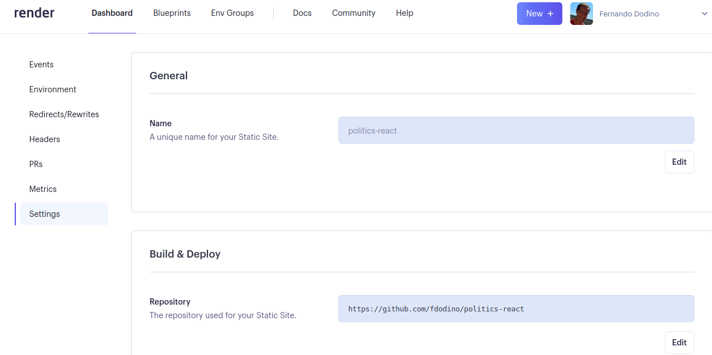
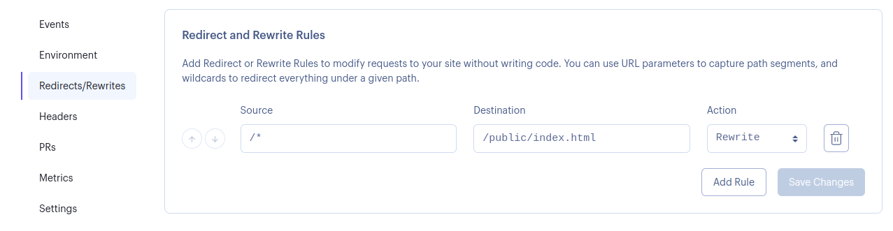
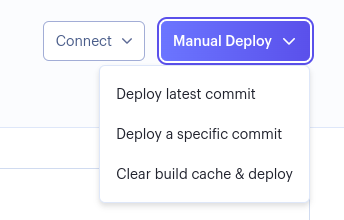
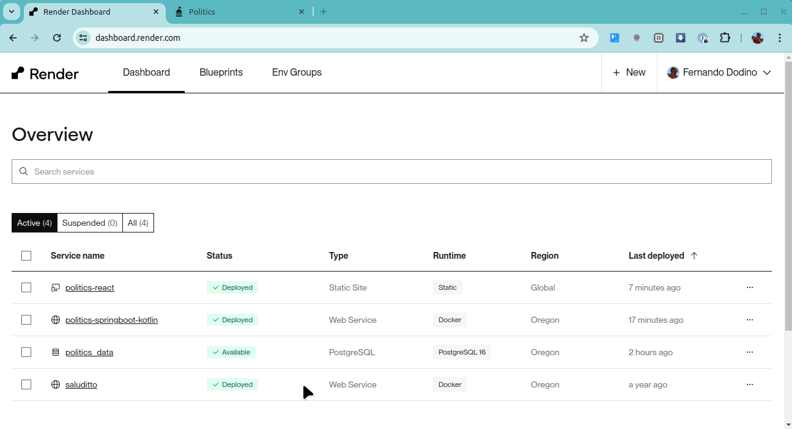

## Ejemplo Politics

 

La explicación del ejercicio la podés encontrar en [este repositorio](https://github.com/uqbar-project/eg-politics-react). Aquí vamos a deployar la aplicación a la nube.

## Deploy a la nube (Render)

Creamos un _static site_ como aconseja [este tutorial de Render](https://render.com/docs/deploy-create-react-app), configurando las siguientes propiedades:

- General
  - Name: `politics-react`
- Build and Deploy
  - Repository: `https://github.com/fdodino/politics-react` (el link a tu repositorio, podés conectarlo con tu cuenta de Github, darle accesos y eso te habilita a navegar por todos los repositorios asociados)
  - Branch: `master` (atención que esté sincronizado con el branch que querés usar, sobre todo si es `main`)
  - El resto de las opciones utilizar: `npm install; npm run build` como Build Command y `dist` para Publish Directory

Adicionalmente, toda aplicación React que tenga routing necesita configurar la solapa Redirects/Rewrites:

- Source: `/*`
- Destination: `/public/index.html`
- Action: `Rewrite`

y luego deployar. A veces puede avisarte que la aplicación está `Live` pero devolverte un 404, en ese caso hay que deployar manualmente con la opción `Clean build cache & deploy`:

Levantemos el backend si es que no está iniciado, y listo, tenemos la app ejecutándose en la nube:

